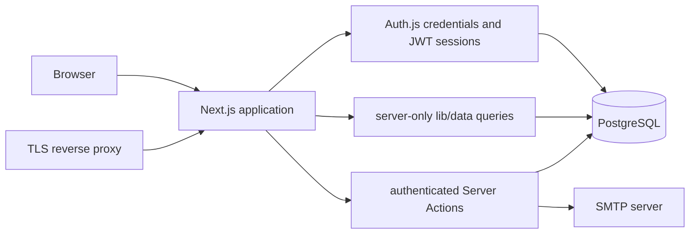

# Topology

# Boundaries

`app/`
: Route composition, metadata, route handlers, and Server Actions.

`lib/data/`
: Server-only read models. `admin.ts` scopes reads by user ID; `public.ts` filters release data to published entries.

`lib/db/`
: Drizzle schema, relations, connection pool, and generated types. The versioned deployment contract is under `drizzle/`.

`components/`
: Presentation and client interactions. Client modules call Server Actions and never open database connections.

`auth.ts`
: Auth.js credentials provider, Drizzle adapter, JWT session enrichment, and password verification.

`proxy.ts`
: Authentication gate for `/admin`; route code repeats ownership checks because middleware is not an authorization boundary.

# Request flows

Public changelog reads use [data-model visibility rules](data-model.md) through `lib/data/public.ts`. Admin pages obtain a session with `lib/auth-helpers.ts`, then use owner-scoped reads. Mutations validate untrusted payloads with Zod, verify ownership, and execute related writes in a database transaction.

Container startup follows the [operations runbook](operations.md): wait for PostgreSQL, apply `drizzle/` migrations, then start Next.js.
