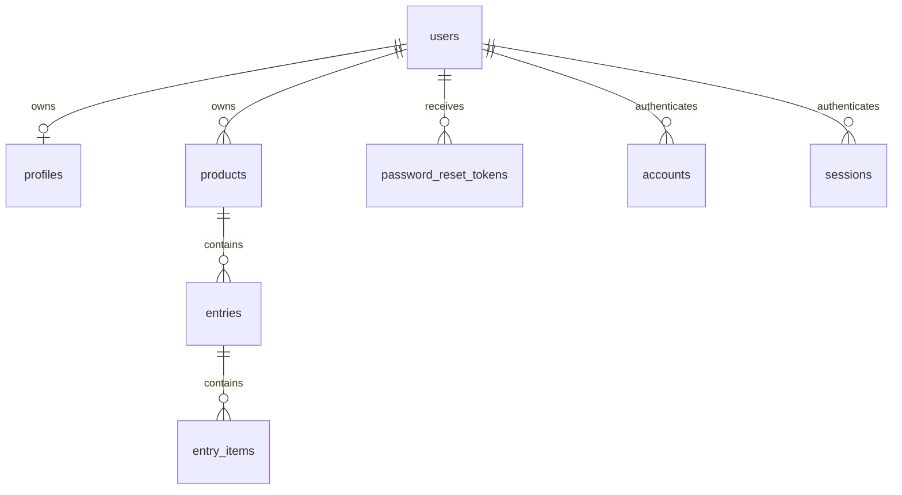

# Relationships

# Core schema

| Table | Identity | Ownership / visibility |
| --- | --- | --- |
| `users` | UUID | Authentication identity; email is unique and normalized by application code. |
| `profiles` | User UUID | Public owner handle and display metadata. |
| `products` | UUID | Owned by `user_id`; slug is unique per owner. |
| `entries` | UUID | Belongs to a product; slug is unique per product; public only when `published = true`. |
| `entry_items` | UUID | Ordered children of an entry. Public visibility derives from the parent entry. |
| `password_reset_tokens` | SHA-256 token hash | One-hour, single-use recovery records; raw tokens are never stored. |
| Auth.js adapter tables | Provider keys | Account/session compatibility; credential sessions currently use JWTs. |

# Invariants

- Admin reads include `products.user_id = session.user.id` directly or reach the same condition through a verified parent.
- Admin mutations repeat the owner condition inside the write query or transaction; UI visibility is never authorization.
- Entry-item updates and deletes include both item ID and verified entry ID.
- Entry plus item saves commit atomically.
- Public reads and feed handlers require `entries.published = true`.
- Deleting a user, product, or entry cascades through owned children.
- All event timestamps are stored with time-zone awareness; `publish_date` is a calendar date.

The application architecture that enforces these rules is documented in [application architecture](architecture.md).
