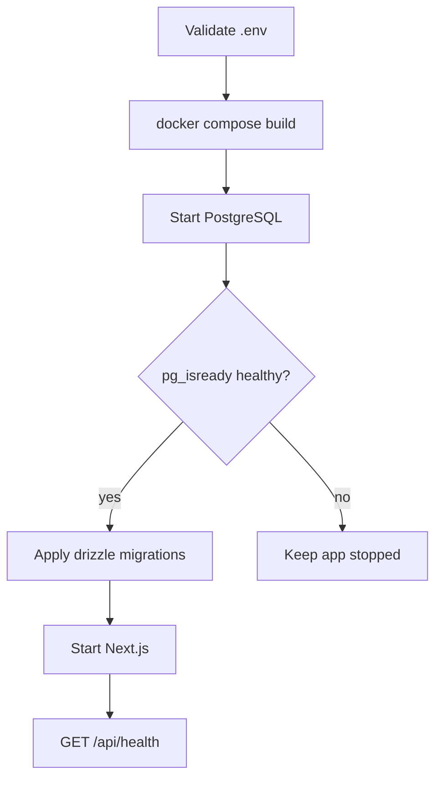

# Deployment flow



# Preflight

- [ ] `APP_URL` is the final HTTPS origin
- [ ] `AUTH_SECRET` contains at least 32 random bytes
- [ ] `DATABASE_URL` and bundled PostgreSQL credentials agree
- [ ] SMTP reset delivery succeeds
- [ ] The reverse proxy forwards standard host and protocol headers
- [ ] Authentication POST routes are rate-limited at the reverse proxy
- [ ] A recent database dump exists off-host

# Commands

```sh
docker compose config
docker compose up -d --build
docker compose ps
curl --fail https://changelog.example.com/api/health
docker compose logs --tail=100 app
```

The health endpoint returns `503` when database configuration is missing or PostgreSQL cannot answer `select 1`.

# Upgrade

1. Take and verify a database dump.
2. Deploy the new revision with `docker compose up -d --build`.
3. Confirm the log reports completed migrations and a ready Next.js server.
4. Confirm `/api/health`, login, a public changelog, JSON, and RSS.

Migrations are forward-only and tracked in PostgreSQL by Drizzle. A startup migration failure prevents application startup.

# Recovery

Restore a custom-format `pg_dump` into an empty compatible PostgreSQL instance, point `DATABASE_URL` at it, and start the app so any newer migrations apply. The volume is working storage, not a backup.

Human-oriented commands and proxy/SMTP detail are in [the self-hosting guide](../docs/SELF_HOSTING.md). Supabase-specific cutover constraints are in [the migration guide](../docs/MIGRATING_FROM_SUPABASE.md). The table relationships involved are in [data model and ownership](data-model.md).
